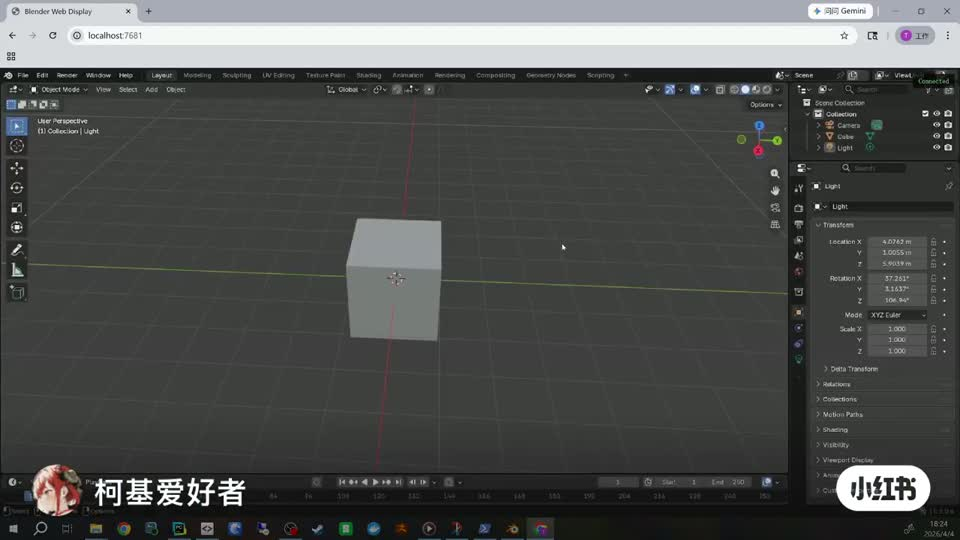
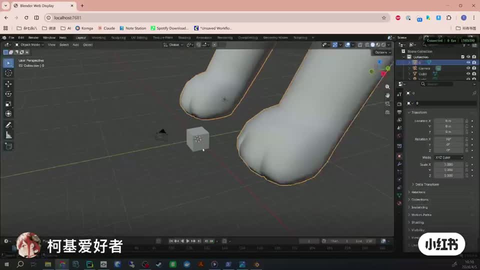

# blender-web

> [!WARNING]
> This is an **experimental project** — a proof of concept exploring whether
> operating Blender from a web browser is feasible. It exists to validate the
> approach, nothing more. I build and test on **Windows only**, and I do **not**
> run comprehensive tests across Blender's feature set — only the streaming path
> itself is exercised. Expect rough edges, and **do not use this in any
> production environment.**

Run a **full, native Blender in the browser** — not a port, not a viewport mirror.

Blender runs unmodified on a machine with a real GPU (Cycles, EEVEE, Python add-ons,
everything works). A custom GHOST display backend streams the interface to any browser
as low-latency H.264 and feeds browser input back into Blender's native event loop.
Think Pixel Streaming / cloud gaming, built directly into Blender's windowing layer.

## Demo

Click a preview to watch the video:

[](https://github.com/jtydhr88/blender-web/raw/master/assets/demo1.mp4)

[](https://github.com/jtydhr88/blender-web/raw/master/assets/demo2.mp4)

```
┌────────────────────────── Blender (native) ──────────────────────────┐
│                                                                      │
│  Vulkan render ─▶ virtual swapchain (GHOST_ContextVK)                │
│                     │ GPU copy, semaphore-ordered, async             │
│                     ├─▶ exportable VkBuffer ── CUDA import ─▶ NVENC  │
│                     │                          (zero-copy H.264)     │
│                     └─▶ host buffer (JPEG / fallback path)           │
│                                        │                             │
│  GHOST_SystemWeb: WebSocket server ◀───┘                             │
│    frames out ─▶ / ◀─ input events (mouse/keyboard/touch/resize)     │
└──────────────────────────────┬───────────────────────────────────────┘
                               │  WebSocket (H.264 NALs / JPEG)
┌──────────────────────────────▼───────────────────────────────────────┐
│  Browser: WebCodecs VideoDecoder (GPU) ─▶ canvas                     │
│           DOM input capture ─▶ JSON events                           │
└──────────────────────────────────────────────────────────────────────┘
```

## How this repository works

This is **not a fork of Blender**. It is a patch-set repository
(ungoogled-chromium style): the backend is ~95% new source files, plus a small
patch touching eight upstream files. A setup script assembles a buildable tree
from an upstream Blender checkout.

```
overlay/          new source files, copied verbatim into the Blender tree
                  (GHOST Web backend, NVENC encoder, nvew loader)
patches/          unified diffs for the eight modified upstream files
comfyui/          ComfyUI custom node package + Blender-side render API
tools/            development utilities (browser input event tester)
scripts/setup.py  assembles the tree
UPSTREAM_COMMIT   the upstream Blender commit releases are built against
```

## Why this approach

Porting Blender to WebAssembly hits hard walls: the 4GB WASM32 memory limit, Cycles'
dependence on CUDA/OptiX/HIP, the embedded CPython, and millions of lines of native
dependencies. Streaming sidesteps all of it — the browser only needs to decode video
and forward input. The cost is one GPU per active session, which is the right trade
for a personal workstation exposed to your own devices.

## Status

| Component | State |
|---|---|
| GHOST Web display backend (window, input, WebSocket server) | working |
| NVENC H.264 hardware encode + WebCodecs decode | working |
| Vulkan backend via virtual swapchain (Blender 5.x default) | working |
| Async GPU readback (no main-thread GPU waits) | working |
| Zero-copy encode (VkBuffer → CUDA → NVENC, no host round-trip) | working |
| OpenGL backend (`--gpu-backend opengl`) | working (legacy path) |
| JPEG fallback (no NVIDIA GPU / during resize) | working |
| Multi-window, touch input, LAN access, HTTPS/WSS proxy | working |
| ComfyUI integration (render API + custom nodes) | working |
| WebRTC transport (UDP, congestion control, NAT traversal) | planned |
| Vulkan Video encode (vendor-neutral, AMD/Intel) | planned |
| Platforms | Windows x64 (Linux: Vulkan path is portable, export uses FD instead of Win32 handles — untested) |

## Requirements

**Server** (where Blender runs)
- Windows 10/11 x64
- Vulkan-capable GPU; NVIDIA GPU for hardware H.264 (any other GPU falls back to JPEG)
- Visual Studio 2022 + CMake to build

**Client**
- Any browser with WebCodecs (Chrome/Edge 94+). Secure Context required for WebCodecs:
  `localhost` qualifies; remote clients use the bundled HTTPS/WSS proxy.
- Without WebCodecs the client still works in JPEG mode.

## Building

```powershell
# 1. Upstream Blender at the pinned commit
git clone https://projects.blender.org/blender/blender.git
cd blender
git checkout (Get-Content ..\blender-web\UPSTREAM_COMMIT)
git submodule update --init lib/windows_x64        # precompiled libraries (large)
cd ..

# 2. Assemble the tree
python blender-web\scripts\setup.py --blender blender

# 3. Build
cd blender
cmake -B build -G "Visual Studio 17 2022" -A x64 `
  -DWITH_GHOST_WEB=ON `
  -DWITH_WEB_NVENC=ON
cmake --build build --config Release --target INSTALL
```

`WITH_GHOST_WEB=ON` replaces the native window system with the Web backend
(the build is dedicated to streaming; keep a normal build for desktop use).
`WITH_WEB_NVENC=ON` enables the NVENC encoder; it loads `nvEncodeAPI64.dll`
at runtime, no NVIDIA SDK needed at build time, and degrades to JPEG when
no NVIDIA GPU is present.

Prebuilt Windows binaries are published on the Releases page.

## Running

```powershell
# Local
blender.exe
# → open http://localhost:7681

# LAN (HTTP; JPEG mode for remote clients unless using the proxy)
$env:BLENDER_WEB_BIND = "0.0.0.0"; blender.exe

# LAN with WebCodecs (HTTPS/WSS proxy, self-signed cert)
python comfyui/blender_web_https.py
# → https://<host>:7683
```

| Env var | Default | Meaning |
|---|---|---|
| `BLENDER_WEB_PORT` | 7681 | HTTP + WebSocket port |
| `BLENDER_WEB_BIND` | 127.0.0.1 | Bind address |

Derived ports: render API = port+1 (7682), HTTPS proxy = port+2 (7683).

The GPU backend defaults to Vulkan (Blender 5.x default). Force the legacy
OpenGL capture path with `blender.exe --gpu-backend opengl`.

## How it works (short version)

- A custom **GHOST display backend** (`GHOST_SystemWeb`) serves the embedded web
  client over HTTP, streams frames over WebSocket and feeds browser input back
  into Blender's native event loop.
- On Vulkan (the Blender 5.x default), a **virtual swapchain** inside
  `GHOST_ContextVK` presents into self-allocated images instead of a native
  surface. Frames are copied on the GPU into an exportable buffer that NVENC
  encodes **directly from GPU memory** (Vulkan → CUDA external memory →
  `NvEncRegisterResource`) — no host round-trip, asynchronous, no main-thread
  GPU waits.
- The browser decodes with **WebCodecs** (hardware H.264). Without NVENC or
  WebCodecs, everything degrades gracefully to JPEG frames.
- Low-latency encoder tuning follows the Sunshine/Moonlight playbook: no
  reordering, no lookahead, infinite GOP with on-demand IDR.

## ComfyUI integration

`comfyui/` provides custom nodes that drive a running Blender: live viewport in
the ComfyUI graph, camera listing/selection, Cycles/EEVEE still renders,
animation and FFmpeg video output — served by a small HTTP API (`/render`,
`/preview`, `/cameras`, `/scene`, `/render/video`, ...) that executes on
Blender's main thread. Install it as a regular ComfyUI custom node and point it
at the Blender instance.

## CI

Two workflows split the load between free hosted runners and the maintainer's
own hardware:

- **patch-check** (`ubuntu-latest`, every push/PR + weekly): shallow-fetches the
  pinned upstream commit and verifies the overlay + patch set still assemble.
  No libraries, no compilation — an upstream-drift alarm that runs in minutes.
- **release-build** (self-hosted Windows runner, tag push / manual dispatch
  only): assembles the tree, builds with MSVC, zips `bin/Release` and attaches
  it to the GitHub release. It is intentionally unreachable from pull requests:
  a self-hosted runner on a public repository must never execute fork code.
  Runner preparation steps are documented at the top of
  [`release-build.yml`](.github/workflows/release-build.yml).

## Roadmap

- **WebRTC transport** — the current WebSocket/TCP path is ideal on localhost/LAN
  but suffers head-of-line blocking on lossy links. RTP over UDP with selective
  retransmission + congestion-driven bitrate matches the existing on-demand-IDR
  recovery model. Signaling can reuse the current WebSocket.
- **Vulkan Video encode** — vendor-neutral hardware H.264/HEVC to replace the
  JPEG fallback on AMD/Intel.
- **Viewport-region streaming** — the virtual swapchain owns the copy region, so
  cropping the encoded area to the 3D viewport is an incremental change.

## License

GPL-2.0-or-later, same as Blender (the assembled tree is a derivative work of
Blender source). `overlay/extern/nvew` headers are MIT (FFmpeg nv-codec-headers).
No NVIDIA SDK binaries are distributed; `nvEncodeAPI64.dll` ships with the NVIDIA
driver and is loaded at runtime, the same approach used by FFmpeg and OBS.

This project is not affiliated with or endorsed by the Blender Foundation.
"Blender" is a trademark of the Blender Foundation.
